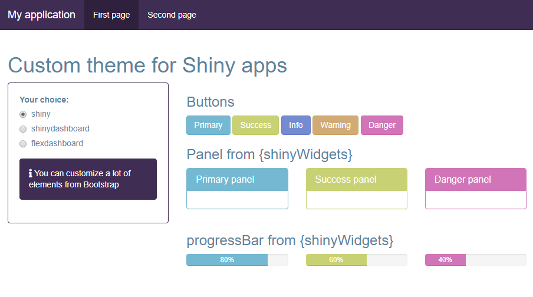
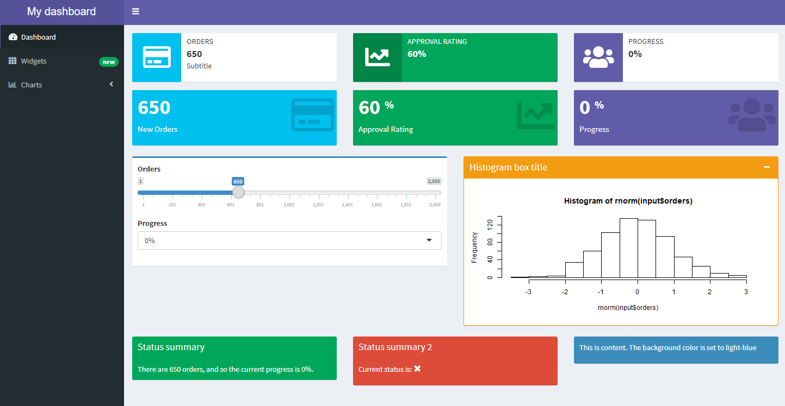
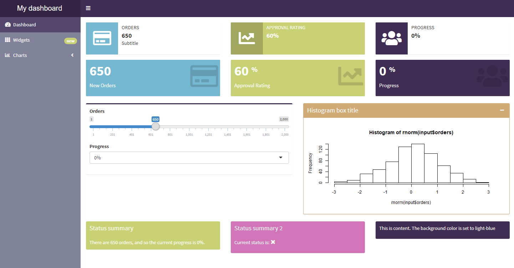

# fresh

> Create fresh themes for use in {shiny} & {shinydashboard} applications and {flexdashboard} documents.

<!-- badges: start -->
[](https://www.tidyverse.org/lifecycle/#experimental)
[](https://www.repostatus.org/#wip)
[](https://travis-ci.org/dreamRs/fresh)
<!-- badges: end -->


## Installation

You can install the development version of fresh from GitHub with:

```r
remotes::install_github("dreamRs/fresh")
```

## shiny

Create new themes to use in shiny applications with `fluidPage` or `navbarPage`. From the default theme :


Obtain this :




This theme was creating with following code:

```r
create_theme(
  theme = "default",
  bs_vars_nav(
    default_bg = "#3f2d54",
    default_color = "#FFFFFF",
    default_link_color = "#FFFFFF",
    default_link_active_color = "#FFFFFF"
  ),
  bs_vars_color(
    gray_base = "#354e5c",
    brand_primary = "#75b8d1",
    brand_success = "#c9d175",
    brand_info = "#758bd1",
    brand_warning = "#d1ab75",
    brand_danger = "#d175b8"
  ),
  bs_vars_state(
    success_text = "#FFF",
    success_bg = "#c9d175",
    success_border = "#c9d175",
    info_text = "#FFF",
    info_bg = "#3f2d54",
    info_border = "#3f2d54",
    danger_text = "#FFF",
    danger_bg = "#d175b8",
    danger_border = "#d175b8"
  ),
  bs_vars_wells(
    bg = "#FFF",
    border = "#3f2d54"
  ),
  output_file = "www/mytheme.css"
)
```

Use the created theme like this: 

```r
navbarPage(
  
  title = "My application",
  theme = "mytheme.css",
  
  ...
)
```


## shinydashboard

Customize colors used in Shiny dashboard applications :

From :



Obtain this :




With:

```r
create_theme(
  adminlte_global(
    content_bg = "#FFF"
  ),
  adminlte_sidebar(
    dark_bg = "#80829a",
    dark_hover_bg = "#53486c"
  ),
  adminlte_color(
    light_blue = "#3f2d54",
    aqua = "#75b8d1",
    green = "#c9d175",
    red = "#d175b8",
    purple = "#3f2d54",
    yellow = "#d1ab75"
  )
)
```
